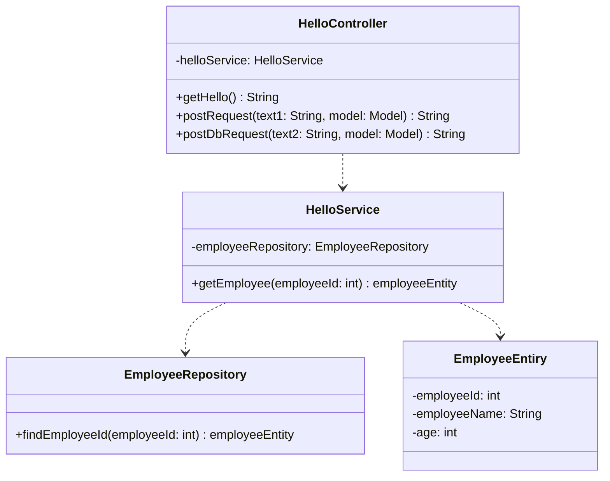

```mermaid
classDiagram
    class HelloController {
        -helloService: HelloService
        +getHello() String
        +postRequest(text1: String, model: Model) String
        +postDbRequest(text2: String, model: Model) String
    }
    
    class HelloService {
        -employeeRepository: EmployeeRepository
        +getEmployee(employeeId: int) employeeEntity
    }
    
    class EmployeeRepository {
        +findEmployeeId(employeeId: int) employeeEntity
    }
    
    class EmployeeEntiry {
        -employeeId: int
        -employeeName: String
        -age: int
    }
        
    HelloController ..> HelloService
    HelloService ..> EmployeeRepository
    HelloService ..> EmployeeEntiry

```