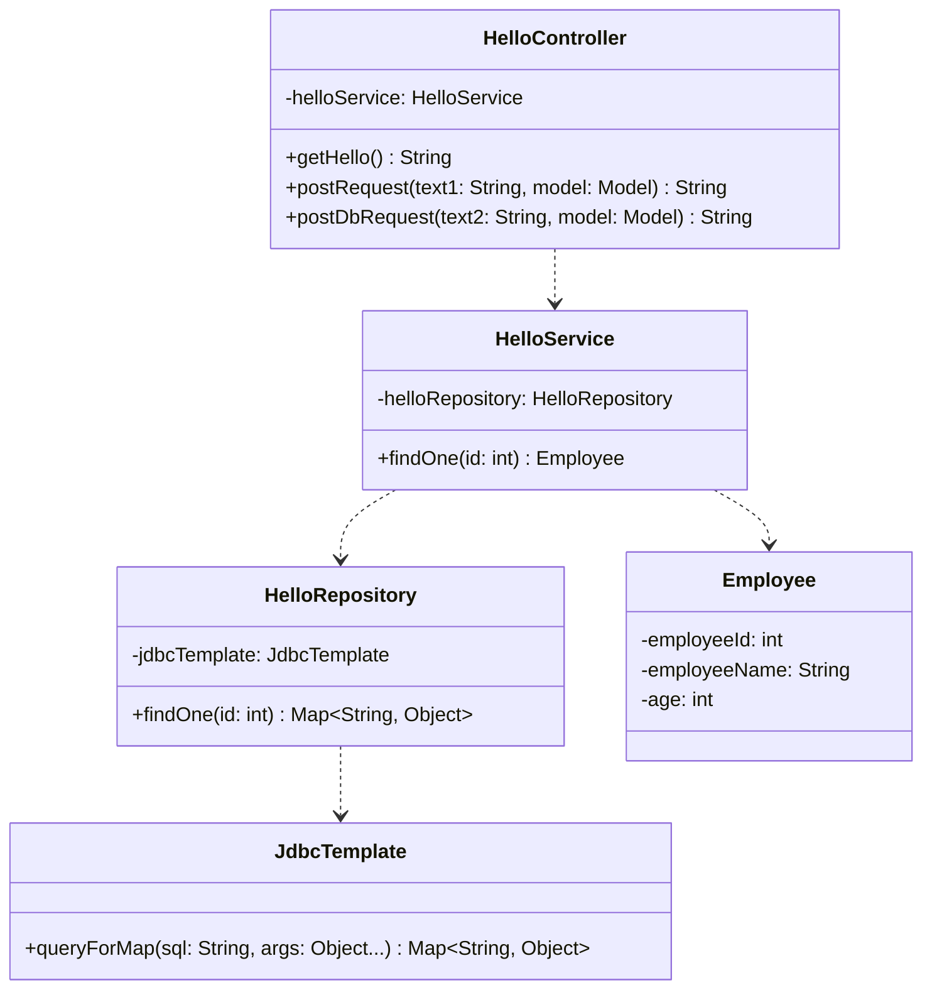

```mermaid
classDiagram
    class HelloController {
        -helloService: HelloService
        +getHello() String
        +postRequest(text1: String, model: Model) String
        +postDbRequest(text2: String, model: Model) String
    }
    
    class HelloService {
        -helloRepository: HelloRepository
        +findOne(id: int) Employee
    }
    
    class HelloRepository {
        -jdbcTemplate: JdbcTemplate
        +findOne(id: int) Map~String, Object~
    }
    
    class JdbcTemplate {
        +queryForMap(sql: String, args: Object...) Map~String, Object~
    }

    class Employee {
        -employeeId: int
        -employeeName: String
        -age: int
    }

    
    HelloController ..> HelloService
    HelloService ..> HelloRepository
    HelloRepository ..> JdbcTemplate
    HelloService ..> Employee
```