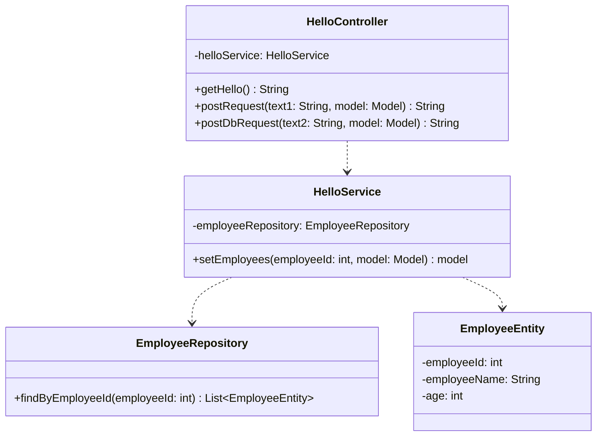

```mermaid
classDiagram
    class HelloController {
        -helloService: HelloService
        +getHello() String
        +postRequest(text1: String, model: Model) String
        +postDbRequest(text2: String, model: Model) String
    }
    
    class HelloService {
        -employeeRepository: EmployeeRepository 
        +setEmployees(employeeId: int, model: Model) model
    }
    
    class EmployeeRepository {
        +findByEmployeeId(employeeId: int) List~EmployeeEntity~
    }
    
    class EmployeeEntity {
        -employeeId: int
        -employeeName: String  
        -age: int
    }
    
    HelloController ..> HelloService
    HelloService ..> EmployeeRepository
    HelloService ..> EmployeeEntity
```